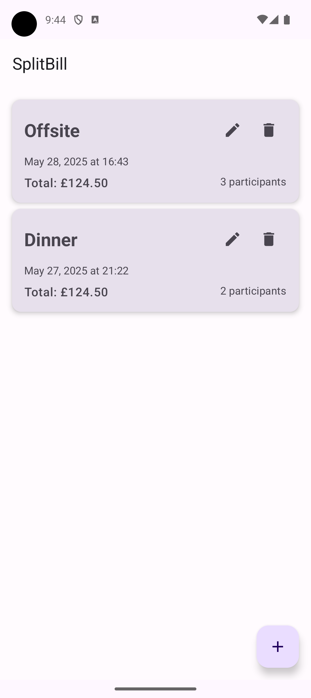
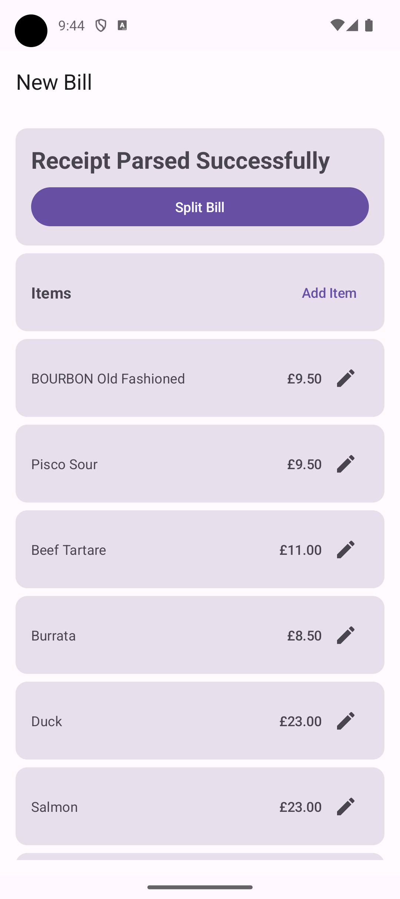
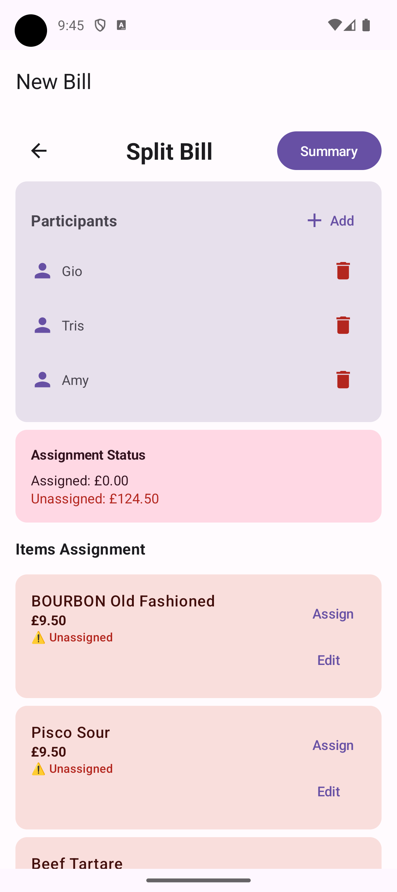
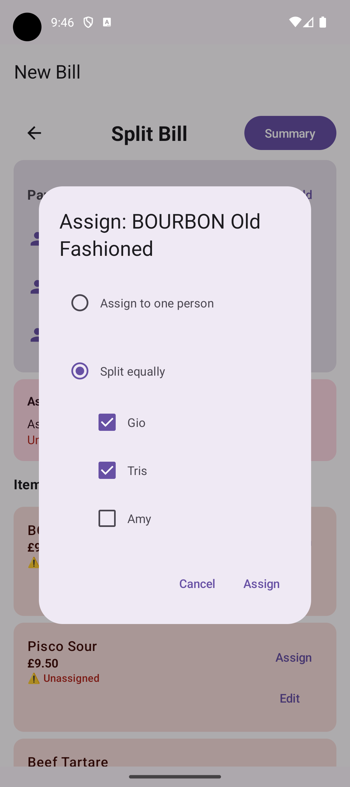
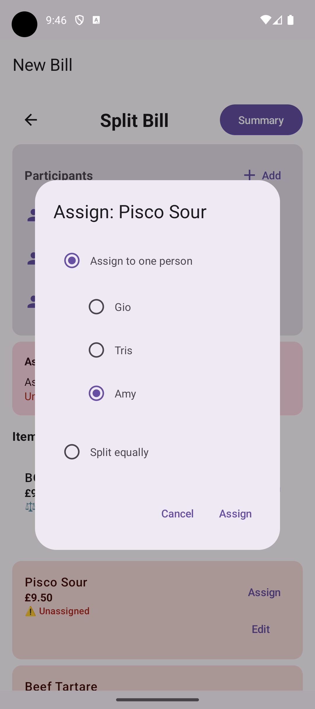
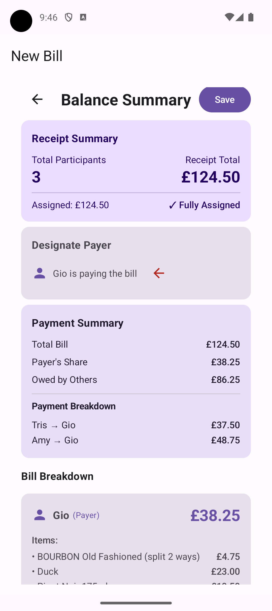
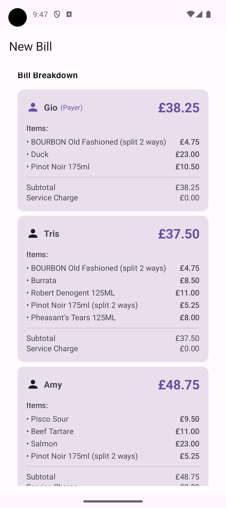

<p align="center">
  
</p>

# Split Bill Android App

A Clean-MVVM Android application for splitting bills using AI-powered receipt parsing.

---

> **This app was created as a demo for the talk:**
>
> <strong>AI-Accelerated Mobile Development - From idea to build, faster than ever. Even when you are the whole team.</strong><br>
> By Gio Scalzo at the Londroid event, NewDay, 29-5-2025.
>
> <em>Every git commit message in this repo is the prompt used for that commit.</em>
>
> <em>The detailed steps followed to build this app are documented in <code>project_steps.md</code>.</em>

---

## Overview

**Split Bill** is a showcase Android app that leverages AI to make splitting restaurant bills effortless. Snap a photo of a UK receipt, let AI parse the items, edit as needed, assign costs, track payments, and keep a history of events—all in a beautiful, modern UI.

---

## Features

- 📷 **Camera and gallery integration** for receipt capture
- 🤖 **AI-powered receipt parsing** using OpenAI gpt-4o-mini
- 🎨 **Material Design 3 UI** with Jetpack Compose
- 🇬🇧 **UK receipt format support** with quantity handling
- ✏️ **Inline editing** of item names, quantities, and costs
- 🛡️ **Secure API key management** via environment variables
- ⚡ **Loading spinner** during API calls
- 🧪 **Mock service** for testing without API calls
- 👥 **Participant management** and local persistence
- ➗ **Flexible split modes**: equal or manual assignment
- ✅ **Payment tracking** and event history

---

## Screenshots

<p align="center">
  
  
  
  
  
  
  
</p>

---

## Setup

### Environment Variables

1. Copy the example environment file:
   ```bash
   cp .env.example .env
   ```

2. Edit `.env` and add your OpenAI API key:
   ```
   OPENAI_API_KEY=sk-your-actual-openai-api-key-here
   ```

3. Get your OpenAI API key from [OpenAI Platform](https://platform.openai.com/api-keys)

### Build and Run

```bash
./gradlew assembleDebug
```

---

## How It Works

1. **Capture or select a receipt photo** using the FAB.
2. **AI parses the receipt** (via OpenAI gpt-4o-mini) and extracts items, prices, service charge, and total.
3. **Edit the parsed list** if needed—change item names, costs, or quantities.
4. **Add/select participants** and assign items (split equally or manually).
5. **Track payments**—each person marks their share as paid, with optional notes.
6. **View event history**—see settled/unsettled bills.

---

## Architecture

- **UI Layer:** Jetpack Compose, Material Design 3
- **Business Logic:** ViewModels, Use Cases
- **Data Layer:** Repository pattern, mockable services
- **AI Integration:** OpenAI API, structured JSON output
- **Network:** Retrofit, OkHttp
- **Persistence:** Local storage for participants and event history

---

## Security

- API keys are stored in `.env` files (excluded from git)
- Images are compressed (not resized) to balance quality and API token usage
- All network calls are asynchronous with robust error handling

---

## Development & Testing

- Use the mock service for rapid development:
  ```kotlin
  // In MainActivity.kt, change to:
  val receiptService: ReceiptParsingService = remember { OpenAIService(useMock = true) }
  ```
- Loading spinner and error handling are built-in for all API calls.
- All features are unit tested and follow Clean-MVVM best practices.

---

## Project Steps & Commit Prompts

- The full step-by-step process used to build this app is in [`project_steps.md`](project_steps.md).
- **Every git commit message is the prompt used for that commit.**

---

## License

MIT License. See [LICENSE](LICENSE) for details.
